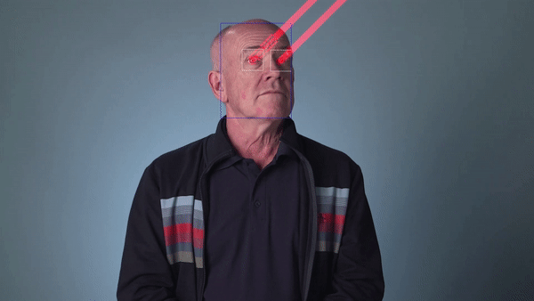
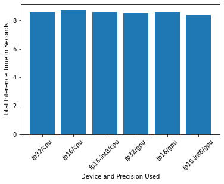
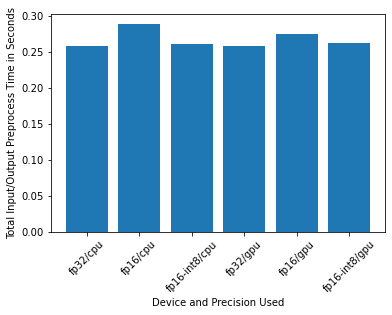
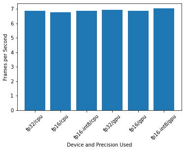
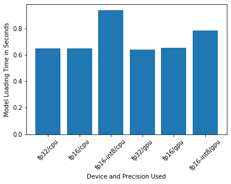

# Computer Pointer Controller

The goal of this project is to use a gaze detection model to control the mouse pointer of the computer. This application uses the [Gaze Estimation](https://docs.openvinotoolkit.org/latest/_models_intel_gaze_estimation_adas_0002_description_gaze_estimation_adas_0002.html) model from the OpenVINO [Open Model Zoo](https://docs.openvinotoolkit.org/latest/_models_intel_index.html) with the [Intel Distribution of OpenVINO toolkit](https://software.intel.com/content/www/us/en/develop/tools/openvino-toolkit.html). It estimates the user's eyes and change the mouse pointer position accordingly. 

The application draws the gaze lines like the laser beams. Just for fun. :-)



## How it Works

The application takes the input from a webcam or a video file. It detects faces in each frame, finds the eyes in the faces, estimates the head rotation angle, then estimate the gaze orientation.

To do this, the project uses the InferenceEngine API from Intel's OpenVINO Toolkit. The [Gaze Estimation](https://docs.openvinotoolkit.org/latest/_models_intel_gaze_estimation_adas_0002_description_gaze_estimation_adas_0002.html) model needs three inputs:

* The head pose
* The left eye image
* The right eye image

So, the application uses three other OpenVINO models to get these inputs:

* [Face Detection](https://docs.openvinotoolkit.org/latest/_models_intel_face_detection_adas_binary_0001_description_face_detection_adas_binary_0001.html).
* [Head Pose Estimation](https://docs.openvinotoolkit.org/latest/_models_intel_head_pose_estimation_adas_0001_description_head_pose_estimation_adas_0001.html)
* [Facial Landmarks Detection](https://docs.openvinotoolkit.org/latest/_models_intel_landmarks_regression_retail_0009_description_landmarks_regression_retail_0009.html)

### The Pipeline

The following shows the flow of data from the input, through the different models, to the mouse controller:


* Face detection model finds the locations of faces in an image.
* Landmark detection model finds the key landmarks from the face in the image. The landmarks includes the locations of the left and right eyes.
* Head pose estimation model finds the directions at which your head is tilted to.
* Gaze estimation model takes in the cropped left and right eye, and the head pose angles to estimate the eye gaze direction.
* The python framework *pyautogui* takes in the eye gaze to control the mouse pointer.

## Project Set Up and Installation

### Requirements

#### Hardware

- 6th to 10th generation Intel® Core™ processor with Iris® Pro graphics or Intel® HD Graphics.
- OR use of Intel® Neural Compute Stick 2 (NCS2)
- Webcam (optional)

#### Software

* Intel® Distribution of OpenVINO™ toolkit 2020.3 release
* Python 3.7
* OpenCV 3.4.2
* pyautogui 0.9.48

### Set up development environment

##### 1. Install OpenVINO Toolkit

If you haven't already, download and install the OpenVINO Toolkit. Follow the OpenVINO's get started guide [here](https://software.intel.com/content/www/us/en/develop/tools/openvino-toolkit/get-started.html).

##### 2. Install dependancies

The best way is to use [Anaconda](https://docs.conda.io/en/latest/miniconda.html):

```
conda env create -f environment.yml
```

### Download the models

Use OpenVINO's `model downloader` to download the models. From the main directory, run:

```
#Linux
python3 $INTEL_OPENVINO_DIR/deployment_tools/tools/model_downloader/downloader.py --list model.lst -o models

#Windows
python "%INTEL_OPENVINO_DIR%\deployment_tools\tools\model_downloader\downloader.py" --list model.lst -o models
```

### Directory Structure

Find the source code for this project under the `/src` directory.

```
.
├── bin
│   └──  demo.mp4
├── app.log
├── model.lst
├── models
├── images
├── Benchmarks.ipynb
├── README.md
├── environment.yml
└── src
    ├── face_detection.py
    ├── facial_landmarks_detection.py
    ├── gaze_estimation.py
    ├── head_pose_estimation.py
    ├── inference.py
    ├── input_feeder.py
    ├── main.py
    └── mouse_controller.py
```

## Demo

Run the application with the demo video file. From the main directory:

```
# Windows
python src\main.py -mfd models\intel\face-detection-adas-binary-0001\FP32-INT1\face-detection-adas-binary-0001 -mhpe models\intel\head-pose-estimation-adas-0001\FP32\head-pose-estimation-adas-0001 -mfld models\intel\landmarks-regression-retail-0009\FP32\landmarks-regression-retail-0009 -mge models\intel\gaze-estimation-adas-0002\FP32\gaze-estimation-adas-0002 -o results -i bin\demo.mp4 -it video --show_input --move_mouse

../models/intel/face-detection-adas-binary-0001/FP32-INT1/face-detection-adas-binary-0001 ../models/intel/head-pose-estimation-adas-0001/FP32/head-pose-estimation-adas-0001 ../models/intel/landmarks-regression-retail-0009/FP32/landmarks-regression-retail-0009 ../models/intel/gaze-estimation-adas-0002/FP32/gaze-estimation-adas-0002 CPU video ../bin/demo.mp4 ../results/cpu
```

To run it with a webcam:

```
# Windows
python src\main.py -mfd models\intel\face-detection-adas-binary-0001\FP32-INT1\face-detection-adas-binary-0001 -mhpe models\intel\head-pose-estimation-adas-0001\FP32\head-pose-estimation-adas-0001 -mfld models\intel\landmarks-regression-retail-0009\FP32\landmarks-regression-retail-0009 -mge models\intel\gaze-estimation-adas-0002\FP32\gaze-estimation-adas-0002 -o results -it cam
```

Find the result video under the `\results` directory. 

## Command Line Arguments

```
usage: main.py [-h] -mfd MODEL_FACE_DETECTION -mhpe MODEL_HEAD_POSE_ESTIMATION
               -mfld MODEL_FACIAL_LANDMARKS_DETECTION -mge
               MODEL_GAZE_ESTIMATION -it INPUT_TYPE [-i INPUT_PATH]
               [-o OUTPUT_PATH] [-l CPU_EXTENSION] [-d DEVICE] [-r]
               [--show_input] [--move_mouse]

optional arguments:
  -h, --help            show this help message and exit
  -mfd MODEL_FACE_DETECTION, --model_face_detection MODEL_FACE_DETECTION
                        Path to an xml file with a trained face detection
                        model.
  -mhpe MODEL_HEAD_POSE_ESTIMATION, --model_head_pose_estimation MODEL_HEAD_POSE_ESTIMATION
                        Path to an xml file with a trained head pose
                        estimation model.
  -mfld MODEL_FACIAL_LANDMARKS_DETECTION, --model_facial_landmarks_detection MODEL_FACIAL_LANDMARKS_DETECTION
                        Path to an xml file with a trained facial landmarks
                        detection model.
  -mge MODEL_GAZE_ESTIMATION, --model_gaze_estimation MODEL_GAZE_ESTIMATION
                        Path to an xml file with a trained gaze estimation
                        model.
  -it INPUT_TYPE, --input_type INPUT_TYPE
                        Specify 'video', 'image' or 'cam' (to work with
                        camera).
  -i INPUT_PATH, --input_path INPUT_PATH
                        Path to image or video file.
  -o OUTPUT_PATH, --output_path OUTPUT_PATH
                        Path to image or video file.
  -l CPU_EXTENSION, --cpu_extension CPU_EXTENSION
                        MKLDNN (CPU)-targeted custom layers.Absolute path to a
                        shared library with thekernels impl.
  -d DEVICE, --device DEVICE
                        Specify the target device to infer on: CPU, GPU, FPGA
                        or MYRIAD is acceptable. Sample will look for a
                        suitable plugin for device specified (CPU by default)
  -r, --raw_output_message
                        Optional. Output inference results raw values showing
  --show_input          Optional. Input video showing
  --move_mouse          Optional. Move mouse based on gaze estimation
```

## Benchmarks
I ran the model on CPU and GPU against models with following precisions:

* FP32
* FP16
* FP16-INT8

And I ran it with four benchmarks: model loading time, input/output preprocessing time, model inference time, and FPS. 

The test results are:

#### Inference time



#### Input/output preprocess time



#### FPS



#### Model loading time



## Results
Models with higher precision usually take longer to run inference. The FP16-INT8 models follow this convention, they have a shorter inference time than FP16 models. 

The inference time for FP16 is longer than FP32 - this is unexpected. My guess is that the time was spent on preprocessing input/output. As shown above, FP16 model has a much longer preprocess time than FP32. 

Overall, GPU models take longer to load. This makes sense as there's startup time for OpenCL. When loading a model, OpenCL uses a just-in-time compiler to compile the code for whatever hardware is being used. This can lead to significantly longer model load time for GPU, when compared with CPU.

## Future Works

- Use Async Inference in the code, benchmark the results and explain its effects on power and performance of the project.
